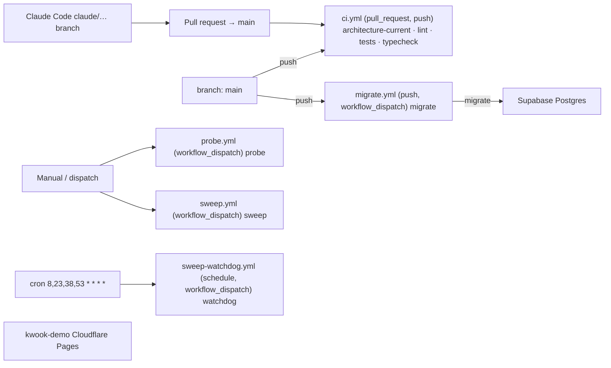
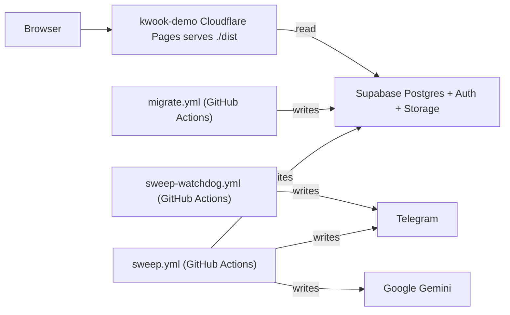
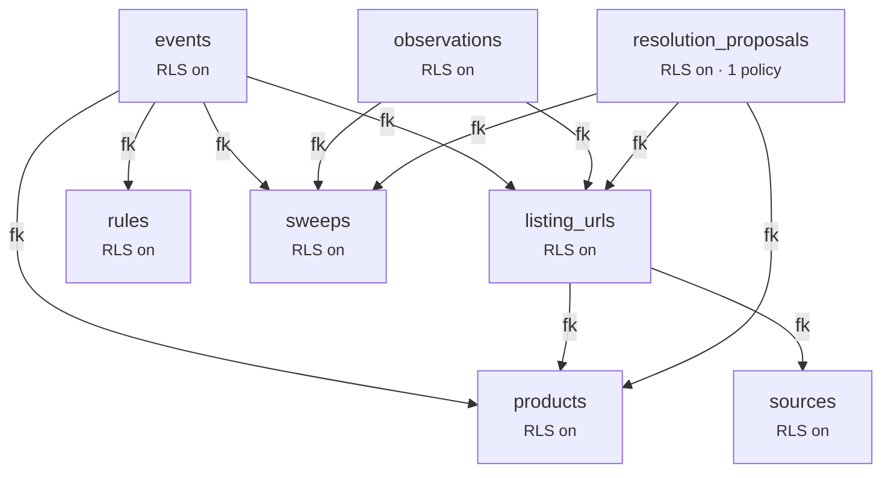

# Architecture

> **Generated file — do not hand-edit.** `scripts/architecture.mjs` draws this
> from the repo's own committed files. To change the picture, change the files
> it reads; the next CI run redraws it. The `architecture-current` job fails if
> this file and the repo disagree.

Derived from **5** workflow file(s), **16** migration(s), and `wrangler.jsonc`.
Nothing here is read from `.claude/scope.json` — that file is gitignored, so CI
cannot see it. Where scope and the repo would disagree, the files are the fact.

## Deploy path

Environments detected: **main only** · branches referenced by workflows: `main`

> ⚠ **No workflow in this repo deploys `kwook-demo`.** Nothing here references
> wrangler or the Cloudflare API, so the deploy is happening outside GitHub Actions
> (a platform Git integration, or by hand). The guide's model is that Actions runs
> every deploy — see `docs/02-set-it-up.md` step 8. No edge is drawn for a deploy
> path that does not exist in these files.

## Runtime

## Data

**8** table(s) across **16** migration(s). RLS is reported on/off only — a regex cannot honestly claim to have read a policy's logic.

## Where each fact came from

| Node | Fact | Source |
|---|---|---|
| ci.yml | jobs: architecture-current · lint · tests · typecheck; on: pull_request, push | `.github/workflows/ci.yml` |
| events | table; RLS on | `supabase/migrations/20260830180000_init.sql` |
| Google Gemini | credential read by sweep.yml | `.github/workflows/sweep.yml` |
| kwook-demo | Cloudflare Pages, build dir ./dist | `wrangler.jsonc` |
| listing_urls | table; RLS on | `supabase/migrations/20260830180000_init.sql` |
| migrate.yml | jobs: migrate; on: push, workflow_dispatch; applies migrations | `.github/workflows/migrate.yml` |
| observations | table; RLS on | `supabase/migrations/20260830180000_init.sql` |
| probe.yml | jobs: probe; on: workflow_dispatch | `.github/workflows/probe.yml` |
| products | table; RLS on | `supabase/migrations/20260830180000_init.sql` |
| resolution_proposals | table; RLS on | `supabase/migrations/20260831130000_resolution_proposals.sql` |
| rules | table; RLS on | `supabase/migrations/20260830180000_init.sql` |
| sources | table; RLS on | `supabase/migrations/20260830180000_init.sql` |
| Supabase | credential read by migrate.yml | `.github/workflows/migrate.yml` |
| Supabase | credential read by sweep.yml | `.github/workflows/sweep.yml` |
| Supabase | @supabase/supabase-js present | `src/lib/supabaseClient.ts` |
| sweep-watchdog.yml | jobs: watchdog; on: schedule, workflow_dispatch | `.github/workflows/sweep-watchdog.yml` |
| sweep.yml | jobs: sweep; on: workflow_dispatch | `.github/workflows/sweep.yml` |
| sweeps | table; RLS on | `supabase/migrations/20260830180000_init.sql` |
| Telegram | credential read by sweep-watchdog.yml | `.github/workflows/sweep-watchdog.yml` |
| Telegram | credential read by sweep.yml | `.github/workflows/sweep.yml` |
